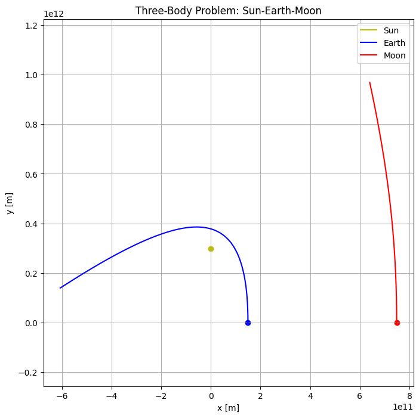

# Three-Body Problem Simulation in Python

This repository demonstrates how to simulate and analyze the **three-body problem** using Python. The three-body problem involves predicting the motion of three massive bodies under their mutual gravitational attraction. It is a fascinating problem in physics and mathematics, often exhibiting chaotic behavior and sensitivity to initial conditions.

---

## Features

- **Mathematical Overview**: Detailed explanation of the equations of motion governing the three-body problem.
- **Numerical Integration**: Implementation using Python's `scipy.integrate.solve_ivp` to solve the coupled ordinary differential equations (ODEs).
- **Visualization**: Interactive plots of the trajectories of the three bodies.
- **Example Simulation**: Includes a simplified simulation of the Sun-Earth-Moon system.

---

## Requirements

Ensure you have Python 3.8+ installed along with the following packages:

- `numpy`
- `scipy`
- `matplotlib`

To install the dependencies, use:

```bash
pip install numpy scipy matplotlib
```

---

## Repository Contents

- **`three_body_problem.py`**: The main Python script containing the implementation of the simulation.
- **`README.md`**: This file, providing an overview of the project.
- **`example_plot.png`**: A sample visualization of the three-body trajectories.

---

## Usage

1. Clone this repository:

```bash
git clone https://github.com/jman4162/three-body-problem.git
cd three-body-problem
```

2. Run the simulation script:

```bash
python three_body_problem.py
```

3. View the plotted trajectories of the three bodies in a 2D plane.

---

## Highlights of the Implementation

### Mathematical Background

The motion of the three bodies is governed by Newton's laws of gravitation and motion. For bodies with masses $m_1$, $m_2$, and $m_3$, the equations of motion are expressed as:

$$
\mathbf{a}_1 = -G m_2 \frac{\mathbf{r}_1 - \mathbf{r}_2}{|\mathbf{r}_1 - \mathbf{r}_2|^3} - G m_3 \frac{\mathbf{r}_1 - \mathbf{r}_3}{|\mathbf{r}_1 - \mathbf{r}_3|^3}.
$$

(Refer to the `three_body_problem.py` script for more details.)

### Numerical Integration

The simulation uses Python's `solve_ivp` function to integrate the ODEs over time. Adaptive time-stepping methods ensure accuracy and efficiency.

### Visualization

The script generates a plot of the trajectories of the three bodies in a 2D plane using Matplotlib. Example:



---

## Example: Sun-Earth-Moon System

The repository includes an example simulation where:
- The Sun, Earth, and Moon are modeled as point masses.
- Initial conditions are chosen to approximate their real-world positions and velocities.

---

## Customization

You can customize the following parameters in `three_body_problem.py`:
- **Masses**: Modify `m_sun`, `m_earth`, `m_moon`.
- **Initial Conditions**: Change the starting positions and velocities of the bodies.
- **Time Span**: Adjust the duration of the simulation (`t_span`).

---

## Learning Objectives

By exploring this repository, you will:
- Gain insights into the physics of the three-body problem.
- Learn how to use Python to numerically solve ODEs.
- Understand the sensitivity and chaotic nature of multi-body gravitational systems.

---

## Contributing

Contributions are welcome! If you find bugs, want to add features, or improve the code, please open an issue or submit a pull request.

---

## License

This project is licensed under the MIT License. See `LICENSE` for details.

---

## Acknowledgments

This project is inspired by the fascinating problem of multi-body dynamics in classical mechanics. The numerical methods and visualization techniques used are based on modern computational tools in Python.
